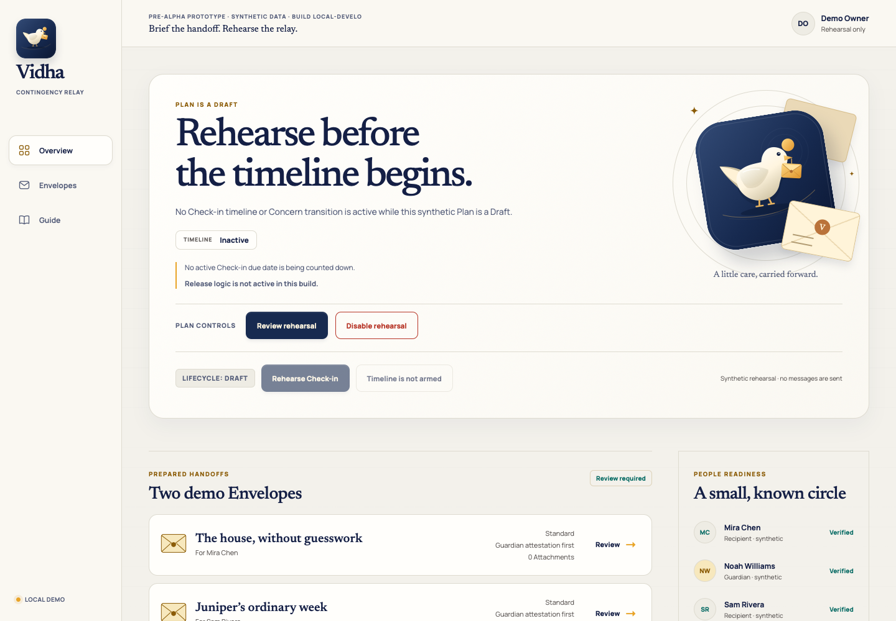

<p align="center">
  <picture>
    <source media="(prefers-color-scheme: dark)" srcset="apps/web/public/vidha-mark-reversed.svg" />
    
  </picture>
</p>

<h1 align="center">Vidha</h1>

<p align="center"><strong>Brief the handoff. Rehearse the relay.</strong></p>

<p align="center">
  An open-source contingency relay for one adult Owner—designed around explicit Check-ins, human verification by default, and recipient-specific Envelopes.
</p>

<p align="center">
  <a href="#run-the-local-prototype">Run the local prototype</a> ·
  <a href="docs/product/OWNER_GUIDE.md">Owner guide</a> ·
  <a href="docs/public-surface/FACT_SHEET.md">See current evidence</a> ·
  <a href="docs/FABLE_BUILD_PROMPT.md">Developer build handoff</a>
</p>

> [!IMPORTANT]
> **Pre-alpha · local synthetic prototype · working name.** There is no hosted service, download, real account, notification delivery, Release path, tag, or GitHub release. The prototype uses disposable synthetic data; refresh clears its browser session. Do not enter personal or sensitive information.

“Vidha” and the courier mark are provisional working concepts. Name and logo clearance are incomplete, and this project makes no exclusivity, cultural-origin, or ownership claim.

## What is Vidha?

Vidha is for someone who wants selected people to receive private messages or documents if they become persistently unreachable. The Owner prepares an individual Envelope for each Recipient, stays in control through deliberate authenticated Check-ins, and chooses a Release Policy for each Envelope.

A missed Check-in may begin **Concern** and verification. It never proves death, and no email open, link preview, or unauthenticated request can count as a Check-in or authorize a state change.

## What can I try today?

The repository currently provides two kinds of evidence. Neither is a release:

| Path                          | Current status            | What it demonstrates                                                                                                                                                                                                                             |
| ----------------------------- | ------------------------- | ------------------------------------------------------------------------------------------------------------------------------------------------------------------------------------------------------------------------------------------------ |
| Local browser prototype       | Available from source     | Draft rehearsal, plan lifecycle controls, Check-ins through Concern, an in-memory event record, and a versioned synthetic Editable Document workspace                                                                                            |
| Phase 3B foundations          | Code and disposable tests | Loopback WebAuthn/session rehearsal, PostgreSQL atomic scheduled-command crash/catch-up seams, fenced work, atomic metadata-key rotation, authenticated logical-backup/restore fixtures, and bounded rootless file/ClamAV/Pandoc isolation gates |
| Hosted service or v1 download | **Unavailable**           | Planned only; no public deployment, installer, supported-browser matrix, or update guarantee exists                                                                                                                                              |

The browser prototype deliberately stops at Concern. Guardian Attestations, Veto Window, Delivery Hold, Automatic Fallback, real notifications, Recipient retrieval, and Release are not implemented. Bounded Guardian Attestations are the default intended Release Policy; Automatic Fallback must be explicitly enabled for an individual Envelope.



_Current local WebKit capture using only the repository’s synthetic demo data. It is a pre-alpha rehearsal—not a hosted service or release._

## Run the local prototype

You need Node.js 24 or newer and pnpm 11.17.0.

```sh
pnpm install --frozen-lockfile
pnpm dev
```

Open the local URL printed by Vite. You can:

- rehearse a Draft, then arm, pause, resume, or disable the synthetic Contingency Plan;
- advance one schedule stage at a time from On Time through Concern;
- record an explicit synthetic Check-in and inspect the in-memory event history;
- edit two synthetic Envelopes and reassign their Recipients;
- open either demo Envelope directly from its Overview review action;
- quarantine, preview, and explicitly accept a Markdown or plain-text conversion up to 256 KB;
- stage up to eight common document, image, audio, video, data, contact, or ZIP files as session-only Attachment candidates, with a 5 MB per-file and 20 MB per-Envelope fixture limit;
- review, download, or remove exact Attachment bytes without claiming upload, scanning, safe preview, encryption, persistence, or delivery;
- save up to six document-only session versions, review exactly which fields a restore changes, preserve the current draft before restoring, inspect conversion provenance, restore or download the original source, and download a portable Markdown, text, or escaped semantic HTML copy from schema v1;
- receive a browser warning before common reload paths after accepted session work or during file preparation, resolve every file decision before Draft rehearsal or Arm, explicitly review everything a waiting app update will clear, and see when another tab holds a separate unsynchronized rehearsal;
- open the in-app Owner guide for the four-part rehearsal path, role boundaries, file contract, and the consequences of each intended Protection Mode and Release Policy.

Browser import and Attachment handling are synthetic fixtures—not malware scanning, sandboxed conversion, encryption, or delivery. Approved content and exact source bytes remain in memory for the current session only. See the [Owner guide](docs/product/OWNER_GUIDE.md) before using the rehearsal.

### Verify the repository

```sh
pnpm check
pnpm exec playwright install chromium firefox webkit
pnpm test:e2e
# Both require Docker and use only disposable synthetic PostgreSQL data.
pnpm test:backup
pnpm test:webauthn
```

The production build contains PWA infrastructure and a prompted service-worker update flow. Changed in-memory rehearsals activate common reload protection; a waiting build is blocked during Owner actions or active file preparation/approval, requires an explicit **Update and clear session** decision, and remains open if the update fails. Same-origin tabs exchange only ephemeral presence, changed-work, action-pending, and file-review-pending flags; they never synchronize content, and changed work or an unsettled operation in another tab holds updates and fresh-session clearing here until that peer closes. Local Envelope identifiers route the Owner back to a pending review but never cross tabs. This does not save, merge, or migrate state, recover a bad service worker, or establish supported-browser installation/update behavior, so the v1 release gate remains unchecked.

## How the intended relay works

This is the target journey, not a claim that v1 exists:

1. The Owner prepares recipient-specific Envelopes and completes a safe rehearsal.
2. The Owner arms the Contingency Plan and completes authenticated Check-ins on their schedule.
3. Persistent inactivity may enter Concern, where bounded verification can begin without drawing a conclusion.
4. Every potential Release must preserve the full final notice and Veto Window. If every verified Owner channel fails before Release—including negative delivery evidence after initial provider acceptance—the Envelope enters Delivery Hold; clearing that hold starts a new full Veto Window.
5. Only an authorized Release makes one Envelope available to its designated Recipient through authenticated retrieval.

See the [product brief](docs/product/PRODUCT_BRIEF.md), [canonical vocabulary](CONTEXT.md), and [v1 release gates](docs/release/V1_RELEASE_GATES.md) for the complete contract.

## Trust boundaries

- Vidha is a contingency relay—not a death detector, legal will, estate platform, password manager, asset-transfer system, emergency service, or wellness monitor.
- A Guardian can submit only a bounded Guardian Attestation. That role never grants access to Envelope contents and never asks someone to declare death.
- Notifications contain no private Envelope content; they lead an authenticated Recipient to retrieval.
- Standard Mode and Sealed Mode are design targets, not implemented protection claims in this prototype.
- No AI or probabilistic system may decide Check-in, Concern, Guardian quorum, Veto Window, or Release.
- The AGPL application is intended to remain self-hostable behind replaceable infrastructure adapters, but a supported self-hosting path does not exist yet.

Read the [threat model](docs/security/THREAT_MODEL.md) before treating any implementation as trustworthy. The [current fact sheet](docs/public-surface/FACT_SHEET.md) lists both verified evidence and claims that are not yet permitted.

## Architecture

Vidha is a TypeScript monorepo. Safety-sensitive state transitions remain in framework-independent packages; the React client and infrastructure adapters consume those decisions rather than recreating them.

| Path                                             | Responsibility                                                                        |
| ------------------------------------------------ | ------------------------------------------------------------------------------------- |
| [`apps/web/`](apps/web/)                         | Responsive React/Vite synthetic PWA prototype                                         |
| [`apps/runtime/`](apps/runtime/)                 | Disposable API/worker/migrator image                                                  |
| [`packages/domain/`](packages/domain/)           | Pure lifecycle, Check-in, and Concern decisions                                       |
| [`packages/application/`](packages/application/) | Canonical-session and authorization seam                                              |
| [`packages/identity/`](packages/identity/)       | Synthetic Owner identity and recovery contracts                                       |
| [`packages/operations/`](packages/operations/)   | Encrypted-metadata and durable-work contracts                                         |
| [`packages/persistence/`](packages/persistence/) | Disposable Plan-store adapters and parity tests                                       |
| [`packages/platform/`](packages/platform/)       | PostgreSQL identity, Plan, and operations seams                                       |
| [`packages/documents/`](packages/documents/)     | Canonical documents, session versions, portability, and bounded untrusted-file intake |

The [Phase 3B evidence map](docs/architecture/FOUNDATION_PHASE_3B.md) explains what the production-shaped foundations prove—and what they do not.

<details>
<summary><strong>Current implementation boundary</strong></summary>

Phase 3B adds disposable executable evidence for exact WebAuthn RP/origin checks, one-time ceremonies and proofs, an opt-in loopback HTTP/session boundary, digest-only session storage, revisioned recovery locks, PostgreSQL Plan/audit/outbox/claimed-job atomicity, canonical scheduled `ADVANCE_TIME`, one-stage outage catch-up through Concern, database-time leasing and fencing, atomic persisted metadata-key rewrap, signed authenticated logical-backup generations, isolated restore-safe inspection and explicit promotion, and source-pinned file/ClamAV/Pandoc gates. The import closure additionally binds the exact signature-database manifest and exercises a digest-pinned rootless OCI boundary with no network, read-only inputs/root, bounded resources, mandatory cleanup, and a synthetic adversarial corpus.

The identity route is disabled by default and restricted to `127.0.0.1` with an exact `http://localhost:<port>` origin. Its virtual-authenticator and HTTP-boundary gates do not provide real identities or authenticators, identity proofing, Safari or supported-browser results, a public origin, production sessions, recovery factors, production key custody, streaming or durable database backup, persistent-volume recovery, production signature updating, a general sandbox guarantee, external providers, durable personal-content storage, Guardian authority, or Release.

</details>

## Help, security, and contributing

- Start with [Contributing to Vidha](CONTRIBUTING.md) and preserve the exact vocabulary in [CONTEXT.md](CONTEXT.md).
- Ask product or documentation questions in [GitHub Discussions](https://github.com/udhawan97/Vidha/discussions).
- Report ordinary defects with [GitHub Issues](https://github.com/udhawan97/Vidha/issues).
- Do not disclose a vulnerability or real Envelope scenario publicly; follow the private process in [SECURITY.md](SECURITY.md).
- Use the [Fable build handoff](docs/FABLE_BUILD_PROMPT.md) only when you intend to continue the bounded implementation and decision process.

## License

Vidha is licensed under [AGPL-3.0](LICENSE). You may use, modify, self-host, or commercially operate it; network-hosted modifications must remain available as source under the license terms.
