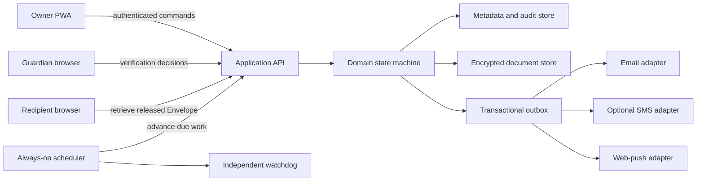

# Proposed architecture

**Status:** Phase 3B has exact-commit disposable evidence for the pure Concern-bounded domain plus PostgreSQL, WebAuthn ceremony, wrapped-key metadata, durable identity/recovery, Plan/audit/outbox, and file/ClamAV/Pandoc adapters. Phase 3C adds a versioned synthetic Editable Document and explicit conversion-review boundary; Phase 3D adds bounded in-memory Document Version and restore planning; Phase 3E adds an exact-state Draft Rehearsal Review; Phase 3F adds serialized local Owner actions and explicit terminal-session replacement; Phase 3G adds session-aware reload protection and an explicit service-worker update-loss decision; Phase 3H adds content-free same-origin tab presence, an unsynchronized-state notice, and destructive update/fresh-session holds when a peer reports changed work or an unsettled Owner action; Phase 3I coordinates asynchronous file review with Draft rehearsal, Arm, reload, update, and peer warning; Phase 3J preserves a Disabled rehearsal as a read-only local workspace while canceling transient mutations; Phase 3K gives both confirmed clearing paths one deterministic current-tab loss inventory and affected-Envelope return route; Phase 3L bounds an accepted Update Handoff and restores the local decision and reload guard when the page remains or returns; Phase 3M injects a validated application build identity and returns a content-free changed-build or unverified receipt after accepted update navigation. Browser authentication, durable content storage or history, production key custody and restore, production upload isolation and signature updating, real notifications, Guardian authority, and Release remain unimplemented.

## Architectural objective

Vidha must continue advancing a transparent contingency timeline when every Owner device is offline, while keeping irreversible Release logic deterministic, testable, and independent of a particular hosting or notification vendor.



The scheduler and watchdog are deliberately separate: the watchdog may alert operators when scheduled work stops, but it has no authority to advance a plan or Release an Envelope.

## Recommended repository shape

The repository is a TypeScript monorepo. Entries marked “implemented” exist in the current synthetic foundation; the remaining entries are proposed and should be added only when their contracts earn the split:

```text
apps/
  web/                 implemented local React/Vite PWA foundation
  runtime/             implemented bundled migrator/API/worker fixture
packages/
  domain/              implemented pure Check-in states, commands, events, invariants
  application/         implemented authenticated commands and authorization orchestration
  identity/            implemented synthetic identity plus WebAuthn ceremony adapters
  persistence/         implemented disposable memory, SQLite, and PGlite Plan stores
  operations/          implemented wrapped metadata, backup, and durable-work contracts
  platform/            implemented disposable PostgreSQL 18 adapters and migrations
  crypto/              proposed reviewed Standard and Sealed Mode boundaries
  documents/           implemented Editable Documents, session versions, portability, and bounded executable intake
  notifications/       proposed provider-neutral outbox and templates
  ui/                  proposed shared components if a second client requires them
infra/
  Dockerfile           implemented digest-pinned disposable runtime image
  compose.yaml         implemented internal synthetic topology fixture
  hosted/              official deployment configuration remains proposed
  self-hosted/         supported deployment documentation remains proposed
docs/
```

This is a recommendation, not permission to create abstractions without a second consumer. The domain package and provider boundaries are required; finer package splits should earn their complexity.

## Domain authority

The domain module owns:

- Check-in acceptance and next due time;
- grace and reminder boundaries;
- entry into and cancellation of Concern;
- Guardian Attestation validation, expiry, conflict handling, and quorum calculation;
- Veto Window eligibility and expiry;
- Delivery Hold entry and exit;
- Automatic Fallback eligibility;
- Release authorization;
- commands rejected because a plan, contact, policy, or credential changed;
- the audit event emitted for every accepted transition.

UI routes, database triggers, cron handlers, and provider webhooks must not independently calculate these answers.

## Candidate state model

Keep plan lifecycle separate from a particular concern cycle.

```text
Plan: Draft -> Armed <-> Paused -> Disabled

Cycle: OnTime -> Reminder -> Overdue -> Concern
       Concern -> Verification -> VetoWindow -> Released
       VetoWindow -> DeliveryHold -> VetoWindow
       Concern | Verification | VetoWindow | DeliveryHold -> Cancelled
```

The implemented domain provides `Draft -> Armed <-> Paused -> Disabled` with rehearsal-before-arm, recent-authentication and policy-revision checks, Paused timeline suspension, and a new full interval on resume. It also retains `OnTime -> Reminder -> Overdue -> Concern`, authenticated Owner Check-in cancellation, injected time, idempotency keys, monotonic commands, and at most one semantic transition per command. It intentionally has no path beyond Concern. Tests advance time explicitly; production code never waits in real time. For every future Release Policy, catch-up may discover overdue eligibility but cannot create a final notice, consume its full Veto Window, and authorize Release in the same historical-time pass. The window begins only after provider acceptance on at least one Verified Owner Channel. Before Release, later negative evidence must be re-evaluated; if no accepted, non-failed channel remains, the Envelope enters Delivery Hold and clearing it starts a new full window.

## Persistence model

A first schema is expected to include:

- Owners and authentication credentials;
- Contingency Plans and immutable policy revisions;
- Guardians, Recipients, invitations, and verified channels;
- Envelopes, Editable Document versions, Attachments, and Protection Mode;
- Check-ins and concern-cycle state;
- Guardian Attestations, minimized evidence references, conflicts, expiries, and holds;
- outbox messages, provider attempts, and delivery receipts;
- append-only audit events and administrative break-glass events.

Use unique constraints for semantic events such as one reminder per cycle/stage/channel and one Release per Envelope/policy revision. A scheduled job queries indexed `next_action_at` values and processes overdue work, rather than assuming it runs at an exact instant.

## Hosted and self-hosted persistence

The synthetic parity harness compares Node SQLite and PGlite behind one Plan transaction interface; see `PERSISTENCE_PORTABILITY.md`. The intermediate Phase 3B milestone adds a PostgreSQL 18 adapter, checksum-locked migration, separate migrator/API/worker topology, atomic Plan/audit/allowed-work transaction, database-time lease/fencing, and restore-safe denial. PGlite remains contract evidence. Phase 3B closure must still account for:

- reliable scheduled execution when the application is otherwise idle;
- transactions and uniqueness under concurrent jobs;
- encrypted backup and restore rehearsal;
- schema migration parity;
- hosted free-tier limits and denial-of-service exhaustion;
- a self-host path that does not quietly depend on a proprietary control plane.

## Authentication and authorization

- Use passkeys and revocable opaque server sessions for Owner authentication. Guardian and Recipient authentication remain unresolved until their authority contracts exist.
- A reminder URL may establish navigation context but cannot authenticate a state change.
- Sensitive changes require recent strong authentication and notify existing Verified Owner Channels.
- Contact, policy, encryption-mode, and deadline changes receive a cooling-off period before they can affect an active cycle.
- Authorization is role- and Envelope-specific. A Guardian does not gain content access by being a Guardian.
- Role overlap and conflict-of-interest rules remain an explicit interview decision.

## Document and file boundary

The implemented `vidha.editable-document` version 1 schema keeps bounded title, Recipient label, and canonical Markdown together behind one module interface. It deterministically serializes canonical JSON and produces exact Markdown/text plus escaped semantic HTML. Importers remain untrusted conversion boundaries:

1. validate declared and detected type and size;
2. quarantine and scan the original;
3. convert in an isolated worker with strict resource limits;
4. show the Owner a preview and conversion warnings;
5. create a new Editable Document only after confirmation;
6. preserve an approved original as an Attachment where safe.

The separate `vidha.editable-document-history` version 1 interface keeps at most six canonical Document Versions for the current session. Monotonic identities, newest-first ordering, duplicate suppression, counter exhaustion, sparse-input rejection, and valid timestamps are module-owned. Restore planning reports title, Recipient, and Markdown differences and preserves the current draft before returning the chosen document. When history is full, it retains both that current draft and the chosen restore target while evicting the oldest unrelated entry. The web binds a pending plan to the reviewed Envelope, canonical draft, and history; confirmation fails closed if any identity changes. This interface never includes Attachments or imported-source provenance and is not a durable store, autosave mechanism, backup, or audit log.

The web also lifts a content-free file-review summary above the Envelope workspace. Draft rehearsal and Arm fail closed while any local import or Attachment choice is preparing or awaiting a decision; active preparation protects ordinary reload and blocks app update. Only a pending boolean crosses same-origin tabs. Envelope identifiers stay inside local React routing, and no filename, bytes, MIME type, Recipient, document, Attachment, or review result enters the peer protocol. This is browser coordination, not upload status, persistence, a server job, shared content, or a production lock.

When the synthetic Plan becomes Disabled, the web keeps the same Envelope workspace mounted so accepted documents, imported-source bytes, Attachments, undo state, and Document Versions remain inspectable until refresh or confirmed fresh-session replacement. A terminal-state effect invalidates active file reads/approvals, discards pending file decisions, and closes restore review; UI controls and mutation handlers independently reject later edits, restore, removal, import, or version creation. Portable document, imported-original, and Attachment downloads remain available. This is an in-memory read-only presentation boundary, not persistence, an immutable archive, durable deletion, authentication, or server authorization.

Do not execute macros, embedded scripts, external references, or active PDF content. Never promise faithful round-trip editing without format-specific evidence.

## Encryption boundaries

Protection Mode belongs to the Envelope and covers every contained Editable Document and Attachment. Import conversion may change format, but it must not silently change the Protection Mode.

### Standard Mode

- Generate a unique data-encryption key per content item version.
- Store only ciphertext in ordinary persistence.
- Wrap data keys with a managed key boundary that can support recovery and rotation.
- Put every administrative decrypt behind least privilege, explicit reason, step-up authentication, and an immutable break-glass audit event.

### Sealed Mode

Fable must not improvise novel cryptography. Before implementation, produce a short protocol specification covering key creation, recipient enrollment, key recovery, device loss, rotation, Release, revocation, and export; then obtain an independent security review. The UI and API must not offer plaintext search, conversion, preview, support recovery, or server-generated thumbnails when those features contradict the protocol.

## Notification and delivery

Provider adapters accept a domain-neutral delivery task. The transactional outbox records intent before network calls and supports retry with stable provider idempotency keys where available.

- Email is the baseline notification channel.
- Web push may improve routine Check-ins but cannot be the only channel.
- SMS is optional and must expose real provider/carrier cost and registration requirements; self-hosters can bring credentials.
- Provider webhooks update delivery evidence but cannot authorize Release.
- A provider-accepted message is not proof that the Recipient read it.
- For every Release Policy, at least one accepted final Owner notice starts a fresh Veto Window. Provider acceptance is not proof of human receipt. If bounce, rejection, expiry, or validated replay evidence leaves all attempted Owner channels failed before Release, the Envelope enters Delivery Hold; clearing it starts a new full window.

## Observability without surveillance

Collect operational evidence needed to detect missed schedules, failed deliveries, restore failures, and abuse. Do not collect Document content, contact graphs, or behavioral analytics for product growth. Logs must redact tokens, addresses where possible, Envelope titles, filenames, and plaintext.

## Deployment and release shape

Version 1 targets an installable web app, not native desktop installers. The hosted and self-hosted modes must share domain tests and release metadata. Public claims, screenshots, and deployment links are added only after the release candidate is exercised with disposable demo data and the `refresh-docs` gate passes.
