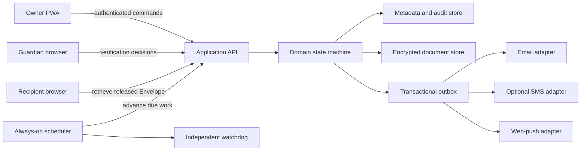

# Proposed architecture

**Status:** Phase 1 implements only the pure domain foundation and local PWA described in ADR 0007. The server, persistence, cryptography, notification, Guardian-authority, and Release boundaries below remain proposals for Fable to verify and turn into accepted ADRs.

## Architectural objective

Vidha must continue advancing a transparent contingency timeline when every Owner device is offline, while keeping irreversible Release logic deterministic, testable, and independent of a particular hosting or notification vendor.



The scheduler and watchdog are deliberately separate: the watchdog may alert operators when scheduled work stops, but it has no authority to advance a plan or Release an Envelope.

## Recommended repository shape

The repository now starts as a TypeScript monorepo. Entries marked “implemented” exist in Phase 1; the remaining entries are proposed and should be added only when their contracts earn the split:

```text
apps/
  web/                 implemented local React/Vite PWA foundation
  worker/              proposed HTTP and scheduled entry points
packages/
  domain/              implemented pure Check-in states, commands, events, invariants
  application/         proposed use cases and authorization orchestration
  persistence/         proposed repository ports and hosted/self-hosted adapters
  crypto/              proposed reviewed Standard and Sealed Mode boundaries
  documents/           proposed editor schema, conversion, export, attachment rules
  notifications/       proposed provider-neutral outbox and templates
  ui/                  proposed shared components if a second client requires them
infra/
  hosted/              official deployment configuration
  self-hosted/         reproducible container and migration configuration
docs/
```

This is a recommendation, not permission to create abstractions without a second consumer. The domain package and provider boundaries are required; finer package splits should earn their complexity.

## Domain authority

The domain module owns:

- Check-in acceptance and next due time;
- grace and reminder boundaries;
- entry into and cancellation of Concern;
- Guardian Attestation validation, expiry, conflict handling, and quorum calculation;
- Veto Window eligibility and expiry;
- Delivery Hold entry and exit;
- Automatic Fallback eligibility;
- Release authorization;
- commands rejected because a plan, contact, policy, or credential changed;
- the audit event emitted for every accepted transition.

UI routes, database triggers, cron handlers, and provider webhooks must not independently calculate these answers.

## Candidate state model

Keep plan lifecycle separate from a particular concern cycle.

```text
Plan: Draft -> Armed <-> Paused -> Disabled

Cycle: OnTime -> Reminder -> Overdue -> Concern
       Concern -> Verification -> VetoWindow -> Released
       VetoWindow -> DeliveryHold -> VetoWindow
       Concern | Verification | VetoWindow | DeliveryHold -> Cancelled
```

Phase 1 implements `OnTime -> Reminder -> Overdue -> Concern`, authenticated Owner Check-in cancellation, injected time, idempotency keys, monotonic commands, and at most one semantic transition per command. It intentionally has no path beyond Concern. The final downstream names and transition table must be resolved through domain modeling. Tests advance time explicitly; production code never waits in real time. For every Release Policy, catch-up can discover overdue eligibility but cannot create a final notice, consume its full Veto Window, and authorize Release in the same historical-time pass. The window begins only after provider acceptance on at least one verified Owner channel. Before Release, later negative evidence is re-evaluated; if no accepted, non-failed channel remains, the Envelope enters Delivery Hold and clearing it starts a new full window.

## Persistence model

A first schema is expected to include:

- Owners and authentication credentials;
- Contingency Plans and immutable policy revisions;
- Guardians, Recipients, invitations, and verified channels;
- Envelopes, Editable Document versions, Attachments, and Protection Mode;
- Check-ins and concern-cycle state;
- Guardian Attestations, minimized evidence references, conflicts, expiries, and holds;
- outbox messages, provider attempts, and delivery receipts;
- append-only audit events and administrative break-glass events.

Use unique constraints for semantic events such as one reminder per cycle/stage/channel and one Release per Envelope/policy revision. A scheduled job queries indexed `next_action_at` values and processes overdue work, rather than assuming it runs at an exact instant.

## Hosted and self-hosted persistence

The initial technical recommendation is a Cloudflare Worker deployment with an indexed SQL store and encrypted object storage, plus a Node-compatible self-host adapter. Fable must compare D1/SQLite portability against one PostgreSQL model before locking the database ADR. The decision must account for:

- reliable scheduled execution when the application is otherwise idle;
- transactions and uniqueness under concurrent jobs;
- encrypted backup and restore rehearsal;
- schema migration parity;
- hosted free-tier limits and denial-of-service exhaustion;
- a self-host path that does not quietly depend on a proprietary control plane.

## Authentication and authorization

- Prefer passkeys for Owner, Guardian, and Recipient authentication.
- A reminder URL may establish navigation context but cannot authenticate a state change.
- Sensitive changes require recent strong authentication and notify existing verified contacts.
- Contact, policy, encryption-mode, and deadline changes receive a cooling-off period before they can affect an active cycle.
- Authorization is role- and Envelope-specific. A Guardian does not gain content access by being a Guardian.
- Role overlap and conflict-of-interest rules remain an explicit interview decision.

## Document and file boundary

Use a versioned canonical editor schema that can produce portable Markdown and accessible HTML. Importers are untrusted conversion boundaries:

1. validate declared and detected type and size;
2. quarantine and scan the original;
3. convert in an isolated worker with strict resource limits;
4. show the Owner a preview and conversion warnings;
5. create a new Editable Document only after confirmation;
6. preserve an approved original as an Attachment where safe.

Do not execute macros, embedded scripts, external references, or active PDF content. Never promise faithful round-trip editing without format-specific evidence.

## Encryption boundaries

Protection Mode belongs to the Envelope and covers every contained Editable Document and Attachment. Import conversion may change format, but it must not silently change the Protection Mode.

### Standard Mode

- Generate a unique data-encryption key per content item version.
- Store only ciphertext in ordinary persistence.
- Wrap data keys with a managed key boundary that can support recovery and rotation.
- Put every administrative decrypt behind least privilege, explicit reason, step-up authentication, and an immutable break-glass audit event.

### Sealed Mode

Fable must not improvise novel cryptography. Before implementation, produce a short protocol specification covering key creation, recipient enrollment, key recovery, device loss, rotation, Release, revocation, and export; then obtain an independent security review. The UI and API must not offer plaintext search, conversion, preview, support recovery, or server-generated thumbnails when those features contradict the protocol.

## Notification and delivery

Provider adapters accept a domain-neutral delivery task. The transactional outbox records intent before network calls and supports retry with stable provider idempotency keys where available.

- Email is the baseline notification channel.
- Web push may improve routine Check-ins but cannot be the only channel.
- SMS is optional and must expose real provider/carrier cost and registration requirements; self-hosters can bring credentials.
- Provider webhooks update delivery evidence but cannot authorize Release.
- A provider-accepted message is not proof that the Recipient read it.
- For every Release Policy, at least one accepted final Owner notice starts a fresh Veto Window. Provider acceptance is not proof of human receipt. If bounce, rejection, expiry, or validated replay evidence leaves all attempted Owner channels failed before Release, the Envelope enters Delivery Hold; clearing it starts a new full window.

## Observability without surveillance

Collect operational evidence needed to detect missed schedules, failed deliveries, restore failures, and abuse. Do not collect Document content, contact graphs, or behavioral analytics for product growth. Logs must redact tokens, addresses where possible, Envelope titles, filenames, and plaintext.

## Deployment and release shape

Version 1 targets an installable web app, not native desktop installers. The hosted and self-hosted modes must share domain tests and release metadata. Public claims, screenshots, and deployment links are added only after the release candidate is exercised with disposable demo data and the `refresh-docs` gate passes.
